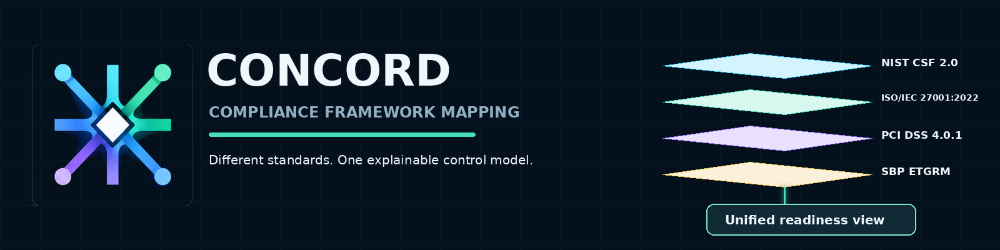
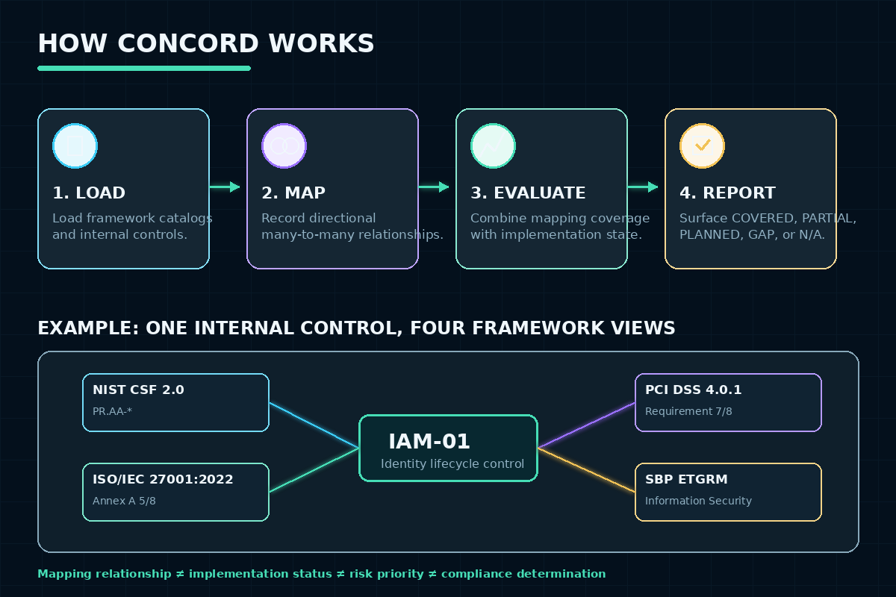

# Concord — Compliance Gap-Analysis Toolkit



*Ships as the `grcmap` CLI/library — see below.*


## Course Information

| Field | Details |
|---|---|
| Course | Information Assurance |
| Semester | Semester 3 — Fall 2024 |
| University | Air University, Islamabad |
| Students | Hussain Ali (232095), Jazib Ali Rizvi (232145), Shehroze Sameer (232091), Sardar Ahmad Ali (232147) |

## Overview

The original coursework is a hypothetical, illustrative contingency and
compliance framework using Habib Bank Limited (HBL) as a reference
organization for the exercise. The report explicitly states it "does not
claim to represent HBL confidential systems, internal controls, or
non-public compliance status" — every figure (RTOs, RPOs, risk ratings)
is an academic estimate for the assignment, not real bank data.

**New addition:** [`grcmap/`](grcmap/), a cross-framework compliance
-mapping and gap-analysis engine. It models a fictional bank (Meridian
Bank, not HBL — see `grcmap/README.md` for why) against the real,
current versions of ISO/IEC 27001:2022, PCI DSS v4.0.1, NIST CSF 2.0, and
Pakistan's real SBP ETGRM framework, using directional set-theory
relationships (NIST IR 8477/OSCAL-inspired) instead of a static one-time
mapping table — and computes readiness/gap reports without ever claiming
certification or compliance.

## Problem Statement

Design a plausible compliance, risk, and business-continuity framework for
a large commercial bank, mapping it against real regulatory/industry
standards. *(New: and treat that mapping as reusable, computable data —
implement a control once, map it outward to every framework it touches,
and recompute readiness when either side changes — rather than a static
document written once.)*

## Objectives

*(original)*
- Map controls against SBP requirements, ISO/IEC 27001, PCI DSS, and NIST CSF.
- Build a risk register covering plausible banking-sector threats.
- Define illustrative RTO/RPO targets per critical service.
- Design an incident-response team structure and procedure.
- Propose a phased implementation roadmap.

*(this rebuild)*
- Model real, current framework taxonomies (not remembered/paraphrased
  versions) and a reusable internal control inventory.
- Represent cross-framework relationships as a directed, many-to-many
  graph with an explicit relationship type and rationale, not a flat
  one-to-one lookup table.
- Keep mapping relationship, implementation status, and compliance
  determination strictly separate, and never claim certification.
- Compute reproducible gap/readiness reports per framework.

## Tools and Technologies

*(original)* N/A — a written policy/framework exercise, no tooling involved.

*(this rebuild)* Python 3.12, PyYAML, NIST's official CPRT data export,
pytest, Ruff, GitHub Actions.

## Features

*(original)*
- Compliance-framework mapping table (SBP / ISO 27001 / PCI DSS / NIST CSF).
- Risk register.
- RTO/RPO tables for core banking, online banking, payments, and call centers.
- Incident-response team and procedure outline.
- 5-phase implementation roadmap.

*(this rebuild — see `grcmap/README.md` for full detail)*
- Real, current framework catalogs: ISO/IEC 27001:2022 Annex A (93
  controls, non-copyrighted short titles only), PCI DSS v4.0.1 (12
  top-level requirements), NIST CSF 2.0 (6 Functions / 22 Categories /
  106 active Subcategories, parsed directly from NIST's own official
  data export), and SBP's real ETGRM framework (BPRD Circular 05/2017,
  6 domains including its own explicit Business Continuity and Disaster
  Recovery section).
- A directed mapping graph (`equal`/`equivalent`/`subset`/`superset`/
  `intersects`/`no_relationship`, each with a rationale) plus explicit,
  reviewer-signed collective coverage assertions for cases where several
  controls jointly (not individually) satisfy one requirement.
- A gap-analysis engine producing COVERED/PARTIAL/PLANNED/GAP/
  NOT_APPLICABLE per requirement, with `not_applicable` always requiring
  a real justification.
- A 33-control, 100-mapping example inventory for a fictional bank
  (Meridian Bank), fully validated and reproducible.
- 53 automated tests, including a unit-level regression test for a real
  aggregation-logic bug found while building this.

## Methodology

1. *(original)* Select a reference organization and scope the exercise as hypothetical/illustrative.
2. *(original)* Map applicable regulatory and industry frameworks.
3. *(original)* Build a risk register and illustrative RTO/RPO targets.
4. *(original)* Draft an incident-response structure and phased roadmap.
5. **New:** genericize the reference organization, model the four real
   framework catalogs as data, build a directed cross-framework mapping
   graph with explicit relationship semantics, and compute reproducible
   gap-analysis reports — see `grcmap/README.md` "Methodology" for the
   full pipeline.

## How It Works



## Repository Structure

```text
hbl-contingency-framework/
  README.md, PROJECT_NOTES.md, CHANGELOG.md, project.yaml
  grcmap/                        NEW: the cross-framework mapping engine
    README.md                    full design writeup and research grounding
    src/grcmap/                  models, loader, validator, coverage, gaps, report, cli
    frameworks/                  iso27001-2022, pci-dss-4.0.1, nist-csf-2.0, sbp-etgrm-2017
      provenance/                NIST's real official CPRT export (source data)
    scripts/                     re-runnable, verified catalog-generation scripts
    examples/meridian-bank/      the fictional example org's control inventory
    mappings/                    internal-control -> framework cross-mappings
    results/                     real generated gap-analysis reports
    tests/                       53 pytest tests
  docs/hbl-contingency-framework-report.docx       original, untouched
  presentation/hbl-contingency-framework-presentation.pptx   original, untouched
  .github/workflows/grcmap-ci.yml   NEW: Ruff + pytest + validate + report
```

## Setup Instructions

Original: N/A — written framework document, no setup required.

New (`grcmap/`):

```bash
cd grcmap
python -m venv .venv && source .venv/bin/activate   # or .venv\Scripts\activate on Windows
pip install -e ".[dev]"
```

## Usage

Original: N/A.

New:

```bash
cd grcmap
grcmap frameworks-list
grcmap gaps --framework nist-csf-2.0
grcmap report --format markdown -o results/full-report.md
```

## How to Review

1. Start with this README, then `docs/hbl-contingency-framework-report.docx` for the original.
2. Review `presentation/hbl-contingency-framework-presentation.pptx` (10 slides) for the original summary.
3. **New:** read `grcmap/README.md`, then `grcmap/src/grcmap/coverage.py`
   (the actual gap-analysis algorithm, and where both real bugs found
   during this rebuild were fixed).
4. Open `grcmap/results/full-report.md` for the real generated output
   across all four frameworks.

## Screenshots

N/A — no screenshots for either the original report-only project or the new CLI tool.

## Results

**Original:** a complete compliance mapping, risk register, RTO/RPO
table set, incident-response outline, and implementation roadmap, all
clearly framed as hypothetical/illustrative academic analysis.

**New:** 53 pytest tests pass; Ruff reports zero issues. `grcmap report`
was actually run end-to-end over all four real framework catalogs and
the 33-control Meridian Bank example inventory — the real output is
committed in `grcmap/results/full-report.md`. See `grcmap/README.md`
"A real methodological finding" for a genuine correction (106 vs. 132
NIST CSF 2.0 subcategories) this project's own data-parsing work
surfaced, and "Two real bugs found" for the aggregation-logic issue
caught by testing the coverage algorithm directly.

## Limitations

*(original)*
- Entirely hypothetical — no real HBL data, systems access, or compliance audit was involved.
- RTO/RPO and risk figures are illustrative academic estimates, not measured or sourced from any real institution.

*(this rebuild — see `grcmap/README.md` for full detail)*
- PCI DSS and SBP ETGRM catalogs model only top-level requirements/domains in v1.
- The 33-control/100-mapping example inventory is representative, not an exhaustive real bank's control set.
- Never emits a compliance percentage or certification/compliance claim — readiness/gap indicators only.

## Future Enhancements

*(original)* N/A — this was a bounded coursework deliverable.

*(this rebuild)* Hierarchical PCI/SBP sub-requirements; NIST CSF
Implementation Tiers at the organization/Function level; a second
example organization to prove the framework catalogs are reusable.

## Safety and Privacy

- Contains no real bank data, credentials, or confidential information of any kind.
- The original report uses a real, named bank as a reference organization for a hypothetical exercise; the report explicitly disclaims any claim to represent that bank's actual systems or compliance status.
- The new `grcmap/` example organization is entirely fictional (Meridian Bank) — see `grcmap/README.md` "Meridian Bank, not HBL" for why this rebuild deliberately does not reuse the real bank name.

## Ethical Notice

This is an academic, hypothetical framework exercise. It should not be
read as, or represented as, an actual assessment of any real
organization's security posture.
